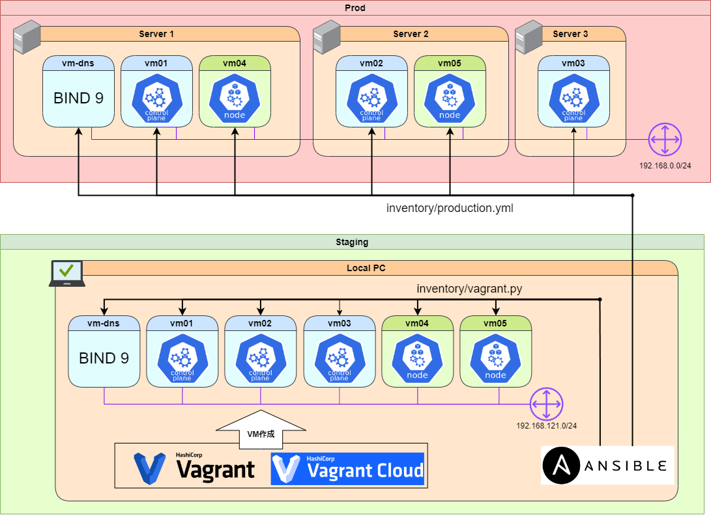

# sample-vagrant-libvirt-ansible-kubernetes



Some scripts written by go are in `tools/cmd`.
See [go.work](./go.work).

```sh
go run ./tools/cmd help
```

## requirements

- Vagrant

  ```sh
  sudo apt update -y
  sudo apt install -y vagrant
  ```

- libvirt (kvm)

  ```sh
  sudo apt -y update
  sudo apt -y install vagrant
  sudo apt -y install \
      qemu-kvm \
      libvirt-daemon-system \
      libvirt-clients \
      virtinst \
      cpu-checker \
      libguestfs-tools \
      libosinfo-bin
  ```

- vagrant-libvirt

  ```sh
  vagrant plugin install vagrant-libvirt
  ```

- Ansible

  ```sh
  make install
  ```
